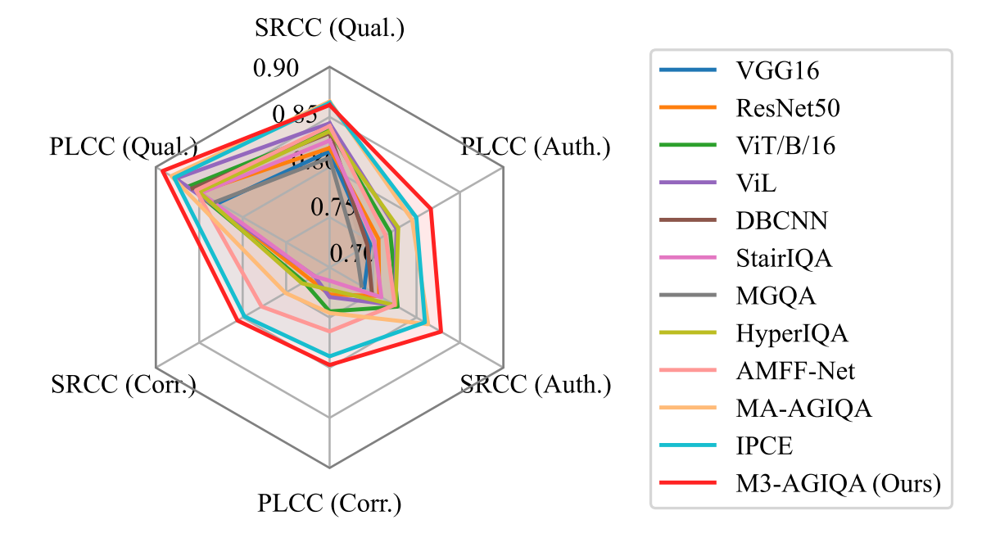
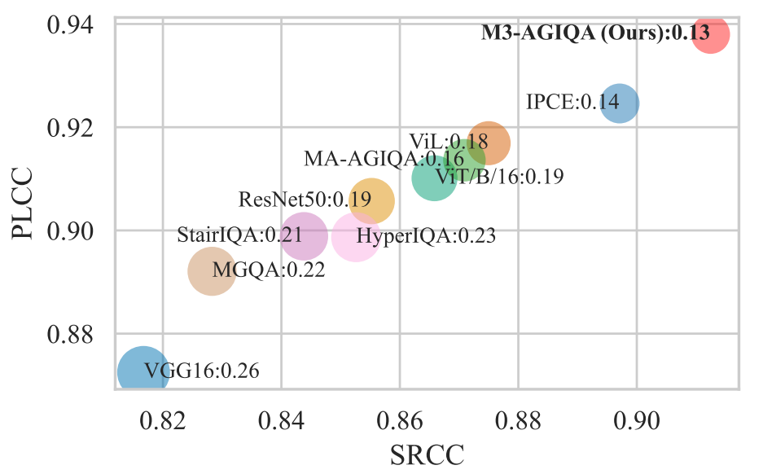

# M3-AGIQA: Multimodal, Multi-Round, Multi-Aspect AI-Generated Image Quality Assessment

This repository contains the implementation of **M3-AGIQA**, a comprehensive framework for evaluating AI-generated images across multiple dimensions. M3-AGIQA integrates multimodal large language models (MLLMs) to assess image quality, correspondence with prompts, and authenticity by leveraging distilled quality captioning capabilities from online MLLMs to local models.

## 🎯 Performance Overview

Performance comparison on the aspects of the AIGCIQA2023 dataset:



Performance comparison on the quality aspect of the AGIQA-3K dataset:


## 📊 Datasets & Pre-trained Models

> **Disclaimer**: The datasets used are from external research papers and are not owned by this repository. They are hosted on Hugging Face or Google Drive for easier access and reproducibility.

### Datasets
- **[AGIQA-3k](https://github.com/lcysyzxdxc/AGIQA-3k-Database)**: A comprehensive dataset for AI-generated image quality assessment
- **[AIGCIQA2023](https://github.com/wangjiarui153/AIGCIQA2023)**: Multi-aspect evaluation dataset from 2023
- **[AIGIQA-20k](https://www.modelscope.cn/datasets/lcysyzxdxc/AIGCQA-30K-Image)**: Large-scale dataset with 20k+ images

**Alternative Download Options:**
- [Google Drive](https://drive.google.com/drive/folders/1-Y75CJgRpgdAVpUAC0y3tapl2xpzg8-x?usp=sharing) (All datasets)
- Hugging Face: [AGIQA-3k](https://huggingface.co/datasets/strawhat/agiqa-3k), [AIGCIQA2023](https://huggingface.co/datasets/strawhat/aigciqa2023), [AIGIQA-20k](https://huggingface.co/datasets/strawhat/AIGIQA-20k)

> **Note**: For AIGIQA-20k, download the [original dataset](https://www.modelscope.cn/datasets/lcysyzxdxc/AIGCQA-30K-Image) and combine it with the descriptors provided in `AIGIQA-20k.7z`.

### Pre-trained Model Checkpoints

**AGIQA-3k Fine-tuned Models:**
- [Quality Assessment](https://huggingface.co/strawhat/minicpm2.5-agiqa-3k-ft)
- [Correspondence Analysis](https://huggingface.co/strawhat/minicpm2.5-agiqa-3k-corr-ft)

**AIGCIQA2023 Fine-tuned Models:**
- [Quality Assessment](https://huggingface.co/strawhat/minicpm2.5-aigciqa2023-ft)
- [Correspondence Analysis](https://huggingface.co/strawhat/minicpm2.5-aigciqa2023-corr-ft)
- [Authenticity Assessment](https://huggingface.co/strawhat/minicpm2.5-aigciqa2023-auth-ft)

**AIGIQA-20k Fine-tuned Models:**
- [Quality Assessment](https://huggingface.co/strawhat/minicpm2.5-AIGIQA-20k-ft)

### Loading Pre-trained Models

Checkpoints can be loaded as follows (using `strawhat/minicpm2.5-AIGIQA-20k-ft` as an example):
```py
from transformers import AutoModel
from peft import PeftModel

model = AutoModel.from_pretrained("openbmb/MiniCPM-Llama3-V-2_5", trust_remote_code=True, torch_dtype=torch.float16).eval()
model = PeftModel.from_pretrained(model, "strawhat/minicpm2.5-AIGIQA-20k-ft", trust_remote_code=True, torch_dtype=torch.float16).eval()
```

## 🛠️ Environment Setup

### Requirements
- **CUDA Toolkit 12.1** (required for xLSTM library)
- **Minimum 24GB VRAM** for inference
- The xLSTM library must run on the first GPU (cuda:0). Use `CUDA_VISIBLE_DEVICES=x` to run on a different GPU.

### CUDA Installation
The environment requires CUDA Toolkit 12.1. Ensure `$PATH` and `$LD_LIBRARY_PATH` are set properly. Download and install from [NVIDIA CUDA Toolkit](https://developer.nvidia.com/cuda-12-1-0-download-archive?target_os=Linux&target_arch=x86_64&Distribution=Ubuntu&target_version=20.04&target_type=runfile_local).

> **Note**: CUDA Toolkit can be installed in a user directory without sudo permissions.

### Installation Steps

```bash
export PATH=/home/user/app/cuda-12.1/bin:$PATH
export LD_LIBRARY_PATH=/home/user/app/cuda-12.1/lib64:$LD_LIBRARY_PATH
conda env create -f ./environment_xlstm.yml
conda activate xlstm
```

## 🚀 Inference

> **System Requirements**: At least 24GB VRAM required for inference.

### Single Image Evaluation

Evaluate a single image across different aspects (quality, correspondence, or authenticity):
```bash
# aspect can be quality/correspondence/authenticity
python inference_e2e.py --input /home/cuichuan/data/agiqa-3k/images/midjourney_normal_234.jpg --prompt "a mechanical human arm sticking out of the earth, cold color, soft lighting" --aspect authenticity
```

<details>
<summary>Example output</summary>

```bash
CUDA_VISIBLE_DEVICES=0 python inference_e2e.py --input /home/cuichuan/data/agiqa-3k/images/midjourney_normal_234.jpg --prompt "a mechanical human arm sticking out of the earth, cold color, soft lighting" --aspect authenticity
uintx feature need torch 2.3+, please upgrade pytorch
[2025-07-05 10:03:18,035] [INFO] [real_accelerator.py:203:get_accelerator] Setting ds_accelerator to cuda (auto detect)
Using config file: cfg/minicpm-xlstm-aigciqa2023.yaml
Using MLLM checkpoint: strawhat/minicpm2.5-aigciqa2023-auth-ft
Using config for authenticity: max_slice_nums=9, model_max_length=512
Loading checkpoint shards: 100%|███████████████████████████████████████████████████████████████████████████████████████████████████████████████████████████████████████████████████| 7/7 [00:04<00:00,  1.72it/s]Loading checkpoint shards: 100%|███████████████████████████████████████████████████████████████████████████████████████████████████████████████████████████████████████████████████| 7/7 [00:01<00:00,  5.23it/s]{'verbose': True, 'with_cuda': True, 'extra_ldflags': ['-L/home/cuichuan/miniconda3/envs/xlstm/lib', '-lcublas'], 'extra_cflags': ['-DSLSTM_HIDDEN_SIZE=512', '-DSLSTM_BATCH_SIZE=8', '-DSLSTM_NUM_HEADS=4', '-DSLSTM_NUM_STATES=4', '-DSLSTM_DTYPE_B=float', '-DSLSTM_DTYPE_R=__nv_bfloat16', '-DSLSTM_DTYPE_W=__nv_bfloat16', '-DSLSTM_DTYPE_G=__nv_bfloat16', '-DSLSTM_DTYPE_S=__nv_bfloat16', '-DSLSTM_DTYPE_A=float', '-DSLSTM_NUM_GATES=4', '-DSLSTM_SIMPLE_AGG=true', '-DSLSTM_GRADIENT_RECURRENT_CLIPVAL_VALID=false', '-DSLSTM_GRADIENT_RECURRENT_CLIPVAL=0.0', '-DSLSTM_FORWARD_CLIPVAL_VALID=false', '-DSLSTM_FORWARD_CLIPVAL=0.0', '-U__CUDA_NO_HALF_OPERATORS__', '-U__CUDA_NO_HALF_CONVERSIONS__', '-U__CUDA_NO_BFLOAT16_OPERATORS__', '-U__CUDA_NO_BFLOAT16_CONVERSIONS__', '-U__CUDA_NO_BFLOAT162_OPERATORS__', '-U__CUDA_NO_BFLOAT162_CONVERSIONS__'], 'extra_cuda_cflags': ['-Xptxas="-v"', '-gencode', 'arch=compute_80,code=compute_80', '-res-usage', '--use_fast_math', '-O3', '-Xptxas -O3', '--extra-device-vectorization', '-DSLSTM_HIDDEN_SIZE=512', '-DSLSTM_BATCH_SIZE=8', '-DSLSTM_NUM_HEADS=4', '-DSLSTM_NUM_STATES=4', '-DSLSTM_DTYPE_B=float', '-DSLSTM_DTYPE_R=__nv_bfloat16', '-DSLSTM_DTYPE_W=__nv_bfloat16', '-DSLSTM_DTYPE_G=__nv_bfloat16', '-DSLSTM_DTYPE_S=__nv_bfloat16', '-DSLSTM_DTYPE_A=float', '-DSLSTM_NUM_GATES=4', '-DSLSTM_SIMPLE_AGG=true', '-DSLSTM_GRADIENT_RECURRENT_CLIPVAL_VALID=false', '-DSLSTM_GRADIENT_RECURRENT_CLIPVAL=0.0', '-DSLSTM_FORWARD_CLIPVAL_VALID=false', '-DSLSTM_FORWARD_CLIPVAL=0.0', '-U__CUDA_NO_HALF_OPERATORS__', '-U__CUDA_NO_HALF_CONVERSIONS__', '-U__CUDA_NO_BFLOAT16_OPERATORS__', '-U__CUDA_NO_BFLOAT16_CONVERSIONS__', '-U__CUDA_NO_BFLOAT162_OPERATORS__', '-U__CUDA_NO_BFLOAT162_CONVERSIONS__']}                                                                       
Using /home/cuichuan/.cache/torch_extensions/py311_cu121 as PyTorch extensions root...
Detected CUDA files, patching ldflags
Emitting ninja build file /home/cuichuan/.cache/torch_extensions/py311_cu121/slstm_HS512BS8NH4NS4DBfDRbDWbDGbDSbDAfNG4SA1GRCV0GRC0d0FCV0FC0d0/build.ninja...
Building extension module slstm_HS512BS8NH4NS4DBfDRbDWbDGbDSbDAfNG4SA1GRCV0GRC0d0FCV0FC0d0...
Allowing ninja to set a default number of workers... (overridable by setting the environment variable MAX_JOBS=N)
ninja: no work to do.
Loading extension module slstm_HS512BS8NH4NS4DBfDRbDWbDGbDSbDAfNG4SA1GRCV0GRC0d0FCV0FC0d0...
/home/cuichuan/miniconda3/envs/xlstm/lib/python3.11/site-packages/torchmetrics/utilities/prints.py:43: UserWarning: Metric `SpearmanCorrcoef` will save all targets and predictions in the buffer. For large datasets, this may lead to large memory footprint.
  warnings.warn(*args, **kwargs)  # noqa: B028
Using checkpoint: aigciqa2023/authenticity/best-epoch=15-val_SRCC=0.83.ckpt
/home/cuichuan/miniconda3/envs/xlstm/lib/python3.11/site-packages/transformers/models/auto/image_processing_auto.py:513: FutureWarning: The image_processor_class argument is deprecated and will be removed in v4.42. Please use `slow_image_processor_class`, or `fast_image_processor_class` instead
  warnings.warn(
We detected that you are passing `past_key_values` as a tuple and this is deprecated and will be removed in v4.43. Please use an appropriate `Cache` class (https://huggingface.co/docs/transformers/v4.41.3/en/internal/generation_utils#transformers.Cache)
Raw score: 2.5233030319213867
Results saved to /home/cuichuan/data/agiqa-3k/images/midjourney_normal_234_authenticity_results.json
--------------------
Description: While the image is well-executed in terms of technical skill, the concept of a mechanical arm emerging from the earth is inherently fantastical. The smooth, almost plastic-like texture of the robot hand, combined with the unrealistic lighting and shadowing, further contribute to the artificial feel of the image. It does not resemble a real artwork but rather a high-quality digital illustration.
Score: 2.52, Rating: fair
```
</details>

### Batch Image Evaluation

Process multiple images using a CSV file containing image paths and prompts:
```bash
# aspect can be quality/correspondence/authenticity
CUDA_VISIBLE_DEVICES=1 python inference_e2e.py --input /home/cuichuan/data/agiqa-3k/bulk_inference.csv --aspect quality
```

<details>
<summary>Example CSV file</summary>

```csv
image_path,prompt
/home/cuichuan/data/agiqa-3k/images/AttnGAN_normal_000.jpg,statue of a man
/home/cuichuan/data/agiqa-3k/images/AttnGAN_normal_001.jpg,a tray of sushi
/home/cuichuan/data/agiqa-3k/images/AttnGAN_normal_002.jpg,man lost in space
/home/cuichuan/data/agiqa-3k/images/AttnGAN_normal_003.jpg,a cosmic universe
/home/cuichuan/data/agiqa-3k/images/AttnGAN_normal_004.jpg,red and blue armor
/home/cuichuan/data/agiqa-3k/images/AttnGAN_normal_005.jpg,house of the dragon
/home/cuichuan/data/agiqa-3k/images/AttnGAN_normal_006.jpg,a river in a forest
/home/cuichuan/data/agiqa-3k/images/AttnGAN_normal_007.jpg,a cat doing karaoke
/home/cuichuan/data/agiqa-3k/images/midjourney_lowstep_202.jpg,"a biomechanical blue raspberry made of metal, top view, realistic style"
/home/cuichuan/data/agiqa-3k/images/midjourney_lowstep_203.jpg,"a beautiful brutalist concrete forest temple, elevation view, abstract style"
/home/cuichuan/data/agiqa-3k/images/midjourney_lowstep_204.jpg,"2 friends partying and are facing the camera, close-up, baroque style"
/home/cuichuan/data/agiqa-3k/images/midjourney_lowstep_205.jpg,"the fate of all fools and divine intervention, long-shot, anime style"
/home/cuichuan/data/agiqa-3k/images/midjourney_normal_254.jpg,"portrait of beautiful woman with magical nebula hair, long-shot, soft lighting"
/home/cuichuan/data/agiqa-3k/images/midjourney_normal_255.jpg,"magician god holding a divine staff character design, long-shot, HDR lighting"
/home/cuichuan/data/agiqa-3k/images/midjourney_normal_256.jpg,"full length portrait of a beautiful woman with horns, blurred detail, soft lighting"
```

</details>

<details>
<summary>Example output</summary>

```bash
CUDA_VISIBLE_DEVICES=1 python inference_e2e.py --input /home/cuichuan/data/agiqa-3k/bulk_inference.csv --aspect quality
uintx feature need torch 2.3+, please upgrade pytorch
[2025-07-05 10:07:34,830] [INFO] [real_accelerator.py:203:get_accelerator] Setting ds_accelerator to cuda (auto detect)
Using config file: cfg/minicpm-xlstm-aigciqa-30k.yaml
Using MLLM checkpoint: strawhat/minicpm2.5-AIGIQA-20k-ft
Using config for quality: max_slice_nums=4, model_max_length=768
Loading checkpoint shards: 100%|███████████████████████████████████████████████████████████████████████████████████████████████████████████████████████████████████████████████████| 7/7 [00:04<00:00,  1.71it/s]Loading checkpoint shards: 100%|███████████████████████████████████████████████████████████████████████████████████████████████████████████████████████████████████████████████████| 7/7 [00:01<00:00,  5.29it/s]{'verbose': True, 'with_cuda': True, 'extra_ldflags': ['-L/home/cuichuan/miniconda3/envs/xlstm/lib', '-lcublas'], 'extra_cflags': ['-DSLSTM_HIDDEN_SIZE=512', '-DSLSTM_BATCH_SIZE=8', '-DSLSTM_NUM_HEADS=4', '-DSLSTM_NUM_STATES=4', '-DSLSTM_DTYPE_B=float', '-DSLSTM_DTYPE_R=__nv_bfloat16', '-DSLSTM_DTYPE_W=__nv_bfloat16', '-DSLSTM_DTYPE_G=__nv_bfloat16', '-DSLSTM_DTYPE_S=__nv_bfloat16', '-DSLSTM_DTYPE_A=float', '-DSLSTM_NUM_GATES=4', '-DSLSTM_SIMPLE_AGG=true', '-DSLSTM_GRADIENT_RECURRENT_CLIPVAL_VALID=false', '-DSLSTM_GRADIENT_RECURRENT_CLIPVAL=0.0', '-DSLSTM_FORWARD_CLIPVAL_VALID=false', '-DSLSTM_FORWARD_CLIPVAL=0.0', '-U__CUDA_NO_HALF_OPERATORS__', '-U__CUDA_NO_HALF_CONVERSIONS__', '-U__CUDA_NO_BFLOAT16_OPERATORS__', '-U__CUDA_NO_BFLOAT16_CONVERSIONS__', '-U__CUDA_NO_BFLOAT162_OPERATORS__', '-U__CUDA_NO_BFLOAT162_CONVERSIONS__'], 'extra_cuda_cflags': ['-Xptxas="-v"', '-gencode', 'arch=compute_80,code=compute_80', '-res-usage', '--use_fast_math', '-O3', '-Xptxas -O3', '--extra-device-vectorization', '-DSLSTM_HIDDEN_SIZE=512', '-DSLSTM_BATCH_SIZE=8', '-DSLSTM_NUM_HEADS=4', '-DSLSTM_NUM_STATES=4', '-DSLSTM_DTYPE_B=float', '-DSLSTM_DTYPE_R=__nv_bfloat16', '-DSLSTM_DTYPE_W=__nv_bfloat16', '-DSLSTM_DTYPE_G=__nv_bfloat16', '-DSLSTM_DTYPE_S=__nv_bfloat16', '-DSLSTM_DTYPE_A=float', '-DSLSTM_NUM_GATES=4', '-DSLSTM_SIMPLE_AGG=true', '-DSLSTM_GRADIENT_RECURRENT_CLIPVAL_VALID=false', '-DSLSTM_GRADIENT_RECURRENT_CLIPVAL=0.0', '-DSLSTM_FORWARD_CLIPVAL_VALID=false', '-DSLSTM_FORWARD_CLIPVAL=0.0', '-U__CUDA_NO_HALF_OPERATORS__', '-U__CUDA_NO_HALF_CONVERSIONS__', '-U__CUDA_NO_BFLOAT16_OPERATORS__', '-U__CUDA_NO_BFLOAT16_CONVERSIONS__', '-U__CUDA_NO_BFLOAT162_OPERATORS__', '-U__CUDA_NO_BFLOAT162_CONVERSIONS__']}                                                                                                                                                               
Using /home/cuichuan/.cache/torch_extensions/py311_cu121 as PyTorch extensions root...
Detected CUDA files, patching ldflags
Emitting ninja build file /home/cuichuan/.cache/torch_extensions/py311_cu121/slstm_HS512BS8NH4NS4DBfDRbDWbDGbDSbDAfNG4SA1GRCV0GRC0d0FCV0FC0d0/build.ninja...
Building extension module slstm_HS512BS8NH4NS4DBfDRbDWbDGbDSbDAfNG4SA1GRCV0GRC0d0FCV0FC0d0...
Allowing ninja to set a default number of workers... (overridable by setting the environment variable MAX_JOBS=N)
ninja: no work to do.
Loading extension module slstm_HS512BS8NH4NS4DBfDRbDWbDGbDSbDAfNG4SA1GRCV0GRC0d0FCV0FC0d0...
/home/cuichuan/miniconda3/envs/xlstm/lib/python3.11/site-packages/torchmetrics/utilities/prints.py:43: UserWarning: Metric `SpearmanCorrcoef` will save all targets and predictions in the buffer. For large datasets, this may lead to large memory footprint.
  warnings.warn(*args, **kwargs)  # noqa: B028
Using checkpoint: aigciqa-30k/quality/best-epoch=11-val_SRCC=0.89.ckpt
Processing images:   0%|                                                                                                                                                                  | 0/15 [00:00<?, ?it/s]/home/cuichuan/miniconda3/envs/xlstm/lib/python3.11/site-packages/transformers/models/auto/image_processing_auto.py:513: FutureWarning: The image_processor_class argument is deprecated and will be removed in v4.42. Please use `slow_image_processor_class`, or `fast_image_processor_class` instead
  warnings.warn(
We detected that you are passing `past_key_values` as a tuple and this is deprecated and will be removed in v4.43. Please use an appropriate `Cache` class (https://huggingface.co/docs/transformers/v4.41.3/en/internal/generation_utils#transformers.Cache)
Processing images: 100%|█████████████████████████████████████████████████████████████████████████████████████████████████████████████████████████████████████████████████████████| 15/15 [02:09<00:00,  8.65s/it]
Results saved to /home/cuichuan/data/agiqa-3k/bulk_inference_quality_results.json and /home/cuichuan/data/agiqa-3k/bulk_inference_quality_results.csv
Average score: 3.11
```

</details>

<details>
<summary>Output csv file</summary>

```csv
image_path,prompt,aspect,description,score,rating
/home/cuichuan/data/agiqa-3k/images/AttnGAN_normal_000.jpg,statue of a man,quality,"The image is of low quality. It is blurry, lacks clear definition, and the composition is poorly executed. The color balance is also poor, with a monochromatic scheme that contributes to the overall lack of clarity.",2.8427255153656006,fair
/home/cuichuan/data/agiqa-3k/images/AttnGAN_normal_001.jpg,a tray of sushi,quality,"The image is of very low quality. It is blurry, lacks clear shapes, and the colors are muddled and unrealistic. There is no discernible composition due to the lack of clarity.",2.4134740829467773,fair
/home/cuichuan/data/agiqa-3k/images/AttnGAN_normal_002.jpg,man lost in space,quality,"The image is of very low quality. It is extremely dark and blurry, making it difficult to discern any details. There is no clear subject or composition, and the overall impression is of a poorly executed image.",2.668030261993408,fair
/home/cuichuan/data/agiqa-3k/images/AttnGAN_normal_003.jpg,a cosmic universe,quality,"The image is blurry and lacks visual clarity, making it difficult to discern any specific shapes or objects. The composition is unclear due to the lack of focus. The color palette is dark and muted, which might be appropriate for a cosmic theme, but the overall impression is muddled.",2.20394229888916,fair
/home/cuichuan/data/agiqa-3k/images/AttnGAN_normal_004.jpg,red and blue armor,quality,"The image is blurry and lacks clarity, making it difficult to discern specific details. The composition is poorly defined, with no clear focal point or sense of depth. The color balance is muddled, with a lack of distinct red and blue hues. The technical execution appears to be flawed, resulting in an overall low-quality image.",2.680107593536377,fair
/home/cuichuan/data/agiqa-3k/images/AttnGAN_normal_005.jpg,house of the dragon,quality,"The image is blurry and lacks detail, making it difficult to discern specific shapes or objects. The composition is unclear and lacks a focal point. The color palette is muted and lacks vibrancy.",2.7155463695526123,fair
/home/cuichuan/data/agiqa-3k/images/AttnGAN_normal_006.jpg,a river in a forest,quality,"The image is of very low quality. It is blurry, lacks clear shapes or forms, and the colors are muddled and unrealistic. There is no discernible composition due to the lack of clarity.",2.5884456634521484,fair
/home/cuichuan/data/agiqa-3k/images/AttnGAN_normal_007.jpg,a cat doing karaoke,quality,"The image is of very low quality. It is blurry, lacks detail, and the composition is unclear. There is no discernible cat or karaoke-related elements. The colors are muted and blend into each other, contributing to the overall lack of clarity.",2.476202964782715,fair
/home/cuichuan/data/agiqa-3k/images/midjourney_lowstep_202.jpg,"a biomechanical blue raspberry made of metal, top view, realistic style",quality,"The image is somewhat blurry, particularly around the edges of the object, which detracts from the realism. The composition is simple, focusing on the object from a top-down perspective. The color balance is well-executed, with the blue and metallic tones creating a visually appealing contrast.",3.4680631160736084,good
/home/cuichuan/data/agiqa-3k/images/midjourney_lowstep_203.jpg,"a beautiful brutalist concrete forest temple, elevation view, abstract style",quality,"The image is blurry and lacks detail, making it difficult to discern specific architectural features. The composition is somewhat centered but lacks a clear focal point. The color palette is muted and realistic, but the lack of sharpness detracts from the overall aesthetic.",3.0303492546081543,good
/home/cuichuan/data/agiqa-3k/images/midjourney_lowstep_204.jpg,"2 friends partying and are facing the camera, close-up, baroque style",quality,"The image exhibits a dreamy, painterly quality reminiscent of Baroque portraiture. The lighting is well-executed, creating a sense of depth and highlighting the subjects' faces. However, the image is somewhat blurry, particularly in the background, which detracts from the overall clarity. The composition is simple but effective, focusing on the two women in the foreground.",3.562500476837158,good
/home/cuichuan/data/agiqa-3k/images/midjourney_lowstep_205.jpg,"the fate of all fools and divine intervention, long-shot, anime style",quality,"The image is blurry and lacks detail, making it difficult to discern specific features. The composition is somewhat chaotic, with figures overlapping and a lack of clear focal point. The color palette is muted and lacks vibrancy, contributing to the overall lack of clarity.",3.0093703269958496,good
/home/cuichuan/data/agiqa-3k/images/midjourney_normal_254.jpg,"portrait of beautiful woman with magical nebula hair, long-shot, soft lighting",quality,"The image is of high quality with excellent clarity and sharp focus on the woman's face. The lighting is soft and flattering, creating a dreamy atmosphere. The composition is well-balanced, drawing the viewer's eye to the woman's face. The colors are vibrant and well-saturated, particularly in the hair. There are no noticeable flaws in the technical execution.",4.474240303039551,excellent
/home/cuichuan/data/agiqa-3k/images/midjourney_normal_255.jpg,"magician god holding a divine staff character design, long-shot, HDR lighting",quality,"The image exhibits high visual clarity with sharp details in the wizard's attire and facial features. The composition is well-balanced, focusing on the central figure against a dark, atmospheric background. The lighting is dramatic, highlighting the wizard and creating a sense of depth. Overall, the technical execution is strong, resulting in a visually appealing image.",4.200858116149902,excellent
/home/cuichuan/data/agiqa-3k/images/midjourney_normal_256.jpg,"full length portrait of a beautiful woman with horns, blurred detail, soft lighting",quality,"This is a high-quality image with excellent clarity and sharp focus on the subject. The lighting is well-executed, creating a dramatic and moody atmosphere. The composition is strong, with the woman centered and the background blurred to draw attention to her. There are no noticeable flaws in terms of technical execution.",4.370080947875977,excellent

```
</details>

## 🎯 Training & Prediction

### Training a Model

```
python main.py --config ./cfg/minicpm-xlstm-agiqa-3k.yaml --run_name testrun

# Generating Predictions
# Scores will be stored in ./predictions/<model_name>/<run_name>.json
python main.py --config ./cfg/minicpm-xlstm-agiqa-3k.yaml --stage predict --ckpt_path <best_checkpoint_path> --run_name testrun_predictions
```

## 📁 Dataset Adaptation
Follow these steps to adapt M3-AGIQA to your custom dataset:

**1. Prepare Dataset Structure**
```bash
|--my_dataset
    |--images   # all the images
    |--data.csv # images and their MOS score
    |--train.json   # JSON file with 2 conversations (answers can be empty since no fine-tuning needed)
    |--val.json     # Validation data (check examples in ./data_processed)
```

**2. Generate MLLM Responses**

Call `inference.py` with the following parameters:
- `FINETUNED_CKPT`: Use `strawhat/minicpm2.5-AIGIQA-20k-ft` for better cross-dataset performance
- `eval_data_json`: Path to your evaluation data
- `OUTPUT_FILE`: Desired output file path

**3. Create Configuration File**

Create your own configuration file in `./cfg` directory. Note that `strawhat/minicpm2.5-AIGIQA-20k-ft` requires:
- `model_max_length` set to `768`
- `max_slice_nums` set to `4`

**4. Launch Training and Prediction**

Follow the training and prediction commands described in the previous section.

## 🔧 Advanced: Fine-tuning & Training from Scratch

### Overview

Our experiments demonstrate that fine-tuned MLLMs with additional training yield promising results. If you prefer to train your own MLLM from scratch, follow these additional steps:

### Step-by-Step Process

**1. Generate Quality Descriptions**

Produce intermediate image quality descriptions for your preferred aspect (quality, correspondence, authenticity, or custom aspects) either:
- Manually by human annotators
- Using online MLLM APIs (e.g., Gemini Flash API from Google)

To use Gemini API:
- Run `./analyzers/gemini_image_analyzer.py`
- Create `./analyzers/api.key` file containing your Gemini API keys

**2. Set Up Fine-tuning Environment**

Follow the environment setup instructions from [MiniCPM repository](https://github.com/OpenBMB/MiniCPM-o).

> **Hardware Requirements**: 40GB VRAM recommended for fine-tuning.

**3. Fine-tune the MLLM**

- Copy scripts from `./finetune` directory to your MiniCPM environment
- Apply your custom modifications
- Run `./finetune_lora.sh` to fine-tune the local MLLM

**4. Complete Training**

Follow the remaining training and prediction steps outlined in previous sections.

## 🙏 Acknowledgments

We gratefully acknowledge the following open-source projects that made this work possible:

- **[MiniCPM](https://github.com/OpenBMB/MiniCPM-o)**: Multimodal large language model framework
- **[xLSTM](https://github.com/NX-AI/xlstm)**: Extended Long Short-Term Memory architecture
- **[IQA-PyTorch](https://github.com/chaofengc/IQA-PyTorch)**: Image Quality Assessment toolkit

## 📝 Citation

If you find our work useful for your research, please cite our paper:
```bibtex
@article{cui2025m3agiqa,
    title={M3-AGIQA: Multimodal, Multi-Round, Multi-Aspect AI-Generated Image Quality Assessment}, 
    author={Chuan Cui and Kejiang Chen and Zhihua Wei and Wen Shen and Weiming Zhang and Nenghai Yu},
    journal={arXiv preprint arXiv:2502.13763},
    year={2025}
}
```
